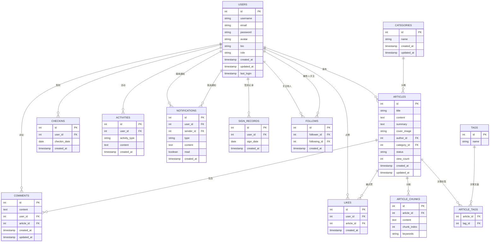

# 博客系统数据库E-R图

根据对项目代码的分析，以下是博客系统的数据库实体关系图：

## 实体关系说明

### 1. 用户 (USERS)
- **一对多**：用户可以发布多篇文章
- **一对多**：用户可以发表多条评论
- **一对多**：用户可以点赞多篇文章
- **一对多**：用户可以进行多次签到
- **一对多**：用户可以产生多条活动记录
- **一对多**：用户可以接收多条通知
- **一对多**：用户可以发送多条通知
- **一对多**：用户可以有多个签到记录
- **多对多**：用户之间可以相互关注（通过FOLLOWS表）

### 2. 文章 (ARTICLES)
- **多对一**：文章属于一个用户（作者）
- **多对一**：文章属于一个分类
- **一对多**：文章可以有多个评论
- **一对多**：文章可以被多个用户点赞
- **一对多**：文章可以被分割成多个片段
- **多对多**：文章可以有多个标签（通过ARTICLE_TAGS表）

### 3. 分类 (CATEGORIES)
- **一对多**：分类可以包含多篇文章

### 4. 标签 (TAGS)
- **多对多**：标签可以关联多篇文章（通过ARTICLE_TAGS表）

### 5. 评论 (COMMENTS)
- **多对一**：评论属于一个用户
- **多对一**：评论属于一篇文章

### 6. 点赞 (LIKES)
- **多对一**：点赞来自一个用户
- **多对一**：点赞针对一篇文章

### 7. 关注 (FOLLOWS)
- **多对一**：关注关系由一个用户发起
- **多对一**：关注关系指向一个用户

### 8. 签到 (CHECKINS)
- **多对一**：签到记录属于一个用户

### 9. 签到记录 (SIGN_RECORDS)
- **多对一**：签到记录属于一个用户

### 10. 活动 (ACTIVITIES)
- **多对一**：活动记录属于一个用户

### 11. 通知 (NOTIFICATIONS)
- **多对一**：通知发送给一个用户
- **多对一**：通知由一个用户发送

### 12. 文章片段 (ARTICLE_CHUNKS)
- **多对一**：文章片段属于一篇文章

## 数据库设计特点

1. **完整性约束**：使用外键确保数据完整性
2. **多对多关系**：通过中间表（如ARTICLE_TAGS、FOLLOWS）处理多对多关系
3. **时间戳**：大多数表都包含created_at和updated_at字段，用于记录数据的创建和修改时间
4. **状态管理**：文章表包含status字段，用于管理文章的发布状态
5. **用户角色**：用户表包含role字段，用于区分普通用户和管理员
6. **冗余设计**：如文章表的view_count字段，用于快速统计浏览量
7. **数据分割**：文章内容被分割存储在ARTICLE_CHUNKS表中，可能用于全文搜索或分块处理

## 注意事项

- 此E-R图基于对代码的分析生成，可能与实际数据库结构存在细微差异
- 部分字段可能根据实际业务需求有所调整
- 外键约束和索引策略可能需要根据实际性能需求进行优化