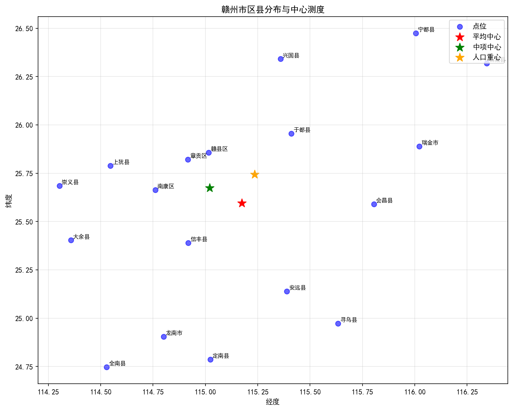
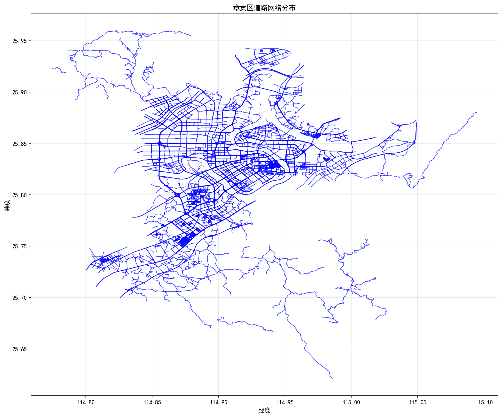
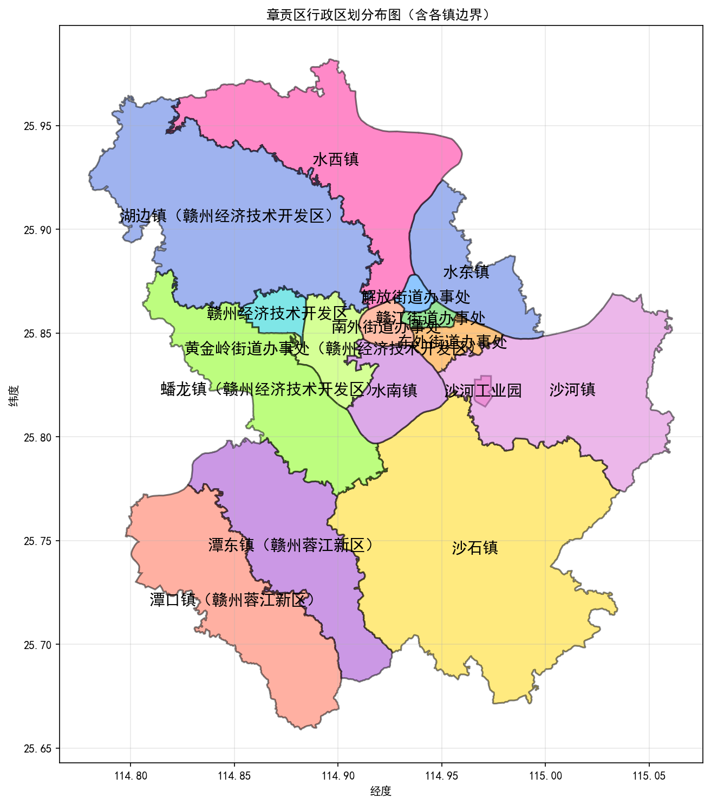

# 空间分布测度实验报告

---

## 一、实验目的

1. 熟悉点、线、面三种类型地理现象空间分布的常用测度指标及其适用特征。
2. 掌握点、线、面地理现象空间分布的主要测度方法及实施过程中的注意事项。
3. 能够运用软件工具或编程手段，实现若干空间分布测度模型的计算，并将其应用于实际地理问题的分析。

---

## 二、实验环境、软件及数据

### 2.1 实验环境
- **操作系统**：Windows
- **编程语言**：Python 3.8
- **开发工具**：Visual Studio Code / Trae IDE

### 2.2 软件工具
| 软件 | 版本 | 用途 |
|------|------|------|
| Python | 3.8 | 编程实现测度计算 |
| pandas | - | 数据处理与分析 |
| numpy | - | 数值计算 |
| matplotlib | - | 数据可视化 |
| shapely | - | 几何空间运算 |
| scipy | - | 空间分析算法 |

### 2.3 实验数据
| 数据名称 | 类型 | 来源 | 说明 |
|----------|------|------|------|
| 计量地理学实验1参考数据-江西.xlsx | Excel | 课程提供 | 赣州市18个区县的经纬度坐标及人口数据 |
| 道路数据 | GeoJSON | OpenStreetMap | 章贡区5109条道路，总长2433.26km |
| 章贡区行政区划数据 | GeoJSON | 高德地图API | 章贡区15个镇/街道的行政区划边界 |

---

## 三、实验内容与步骤

### 3.1 点状分布测度实验

#### 3.1.1 研究区域概况
研究区域为江西省赣州市，位于北纬24°29′-27°09′，东经113°54′-116°38′之间，总面积约39,362.95km²。下辖18个区县，是江西省面积最大、人口最多的地级市。

#### 3.1.2 数据获取
从Excel文件中读取赣州市各区县的经纬度坐标（采用WGS84坐标系）及2010年、2020年人口普查数据。

#### 3.1.3 测度计算方法

**（1）平均中心（Mean Center）**
$$\bar{X} = \frac{\sum_{i=1}^{n} X_i}{n}, \quad \bar{Y} = \frac{\sum_{i=1}^{n} Y_i}{n}$$

**（2）中项中心（Median Center）**
对所有点的X坐标和Y坐标分别排序，取中位数作为中项中心的坐标。

**（3）人口重心（Population Center of Gravity）**
$$X_p = \frac{\sum_{i=1}^{n} P_i \cdot X_i}{\sum_{i=1}^{n} P_i}, \quad Y_p = \frac{\sum_{i=1}^{n} P_i \cdot Y_i}{\sum_{i=1}^{n} P_i}$$
其中 $P_i$ 为第i个区县的常住人口数量。

**（4）最近邻指数（Nearest Neighbor Index, NNI）**
$$NNI = \frac{\bar{D}_{obs}}{\bar{D}_{exp}} = \frac{\bar{D}_{obs}}{\frac{1}{2\sqrt{D}}}}$$
其中 $\bar{D}_{obs}$ 为观测的平均最近邻距离，$D$ 为点要素密度。

- NNI > 1：均匀分布
- NNI = 1：随机分布
- NNI < 1：聚集分布

#### 3.1.4 计算结果

| 测度指标 | X坐标（经度） | Y坐标（纬度） |
|----------|---------------|---------------|
| 平均中心 | 115.1741 | 25.5961 |
| 中项中心 | 115.0196 | 25.6748 |
| 人口重心 | 115.2350 | 25.7446 |

**最近邻指数分析：**

| 指标 | 数值 |
|------|------|
| 最近邻指数（NNI） | 0.0124 |
| 观测平均最近邻距离 | 0.2902° |
| 期望随机分布距离 | 23.3818° |
| 分布模式 | 聚集分布 |

#### 3.1.5 结果可视化

#### 3.1.6 地理学解释

1. **中心位置分析**：
   - 人口重心（115.235°, 25.745°）相对于平均中心（115.174°, 25.596°）明显偏向东北方向，表明赣州市人口在东北部地区集中度更高。
   - 中项中心（115.020°, 25.675°）位于最西侧，反映了部分区县向西偏移的空间分布特征。

2. **最近邻指数解释**：
   - NNI = 0.0124远小于1，表明赣州市区县呈现极强的聚集分布特征。
   - 这种聚集分布与赣州市"一心两翼"的城市空间结构相符，主城区（章贡区）周边区县形成紧密的城市群。

---

### 3.2 线状分布测度实验

#### 3.2.1 研究区域概况
研究区域为赣州市章贡区，是赣州市的主城区和政治、经济、文化中心。章贡区交通网络发达，道路密集度较高。

#### 3.2.2 数据获取
从road.geojson文件中提取章贡区的道路网络数据，包括道路中心线几何信息和道路长度属性。

#### 3.2.3 测度计算方法

**（1）网络维度（Network Dimension）**
采用分形维数方法计算道路网络的复杂程度。通过对数回归分析不同尺度下的道路长度与缓冲区半径关系：
$$L(r) \propto r^D$$
其中 $L(r)$ 为半径为r的缓冲区内的道路总长度，D为分形维数。

**（2）迂回指数（Detour Index）**
$$DI = \frac{\sum_{i=1}^{n} \frac{L_i}{D_i}}{n}$$
其中 $L_i$ 为第i条道路的实际长度，$D_i$ 为该道路起点到终点的直线距离。

- DI越接近1，道路越直
- DI越大，道路越曲折

#### 3.2.4 计算结果

| 测度指标 | 数值 |
|----------|------|
| 道路数量 | 5109条 |
| 道路总长度 | 2433.26km |
| 网络维度（分形维数） | 2.0000 |
| 迂回指数 | 1.2879 |

#### 3.2.5 结果可视化

#### 3.2.6 地理学解释

1. **网络维度分析**：
   - 分形维数D = 2.0，表示道路网络接近平面填充状态，说明章贡区道路网络密度高、覆盖均匀。
   - 城市道路网络发育成熟，支路网密集程度高。

2. **迂回指数分析**：
   - 迂回指数 = 1.2879，接近于1，表明章贡区道路整体较为笔直。
   - 这与章贡区"方格网+自由式"相结合的道路格局相符，老城区以方格网为主，新城区道路规划整齐。

---

### 3.3 面状分布测度实验

#### 3.3.1 研究区域概况
研究区域为赣州市章贡区下辖的15个镇/街道办事处，包括：水东镇、赣江街道办事处、潭东镇、潭口镇、沙石镇、赣州经济技术开发区、黄金岭街道办事处、沙河工业园、东外街道办事处、沙河镇、解放街道办事处、蟠龙镇、水南镇、南外街道办事处、水西镇、湖边镇。

#### 3.3.2 数据获取
从章贡区.geojson文件中提取各行政区的边界坐标数据。

#### 3.3.3 测度计算方法

**（1）延伸率（Elongation Ratio）**
$$ER = \frac{L_{min}}{L_{max}}$$
其中 $L_{min}$ 和 $L_{max}$ 分别为最小和最大外接矩形的边长。ER越接近1，形状越接近圆形。

**（2）形态率（Form Ratio）**
$$FR = \frac{4\pi A}{P^2}$$
其中 $A$ 为多边形面积，$P$ 为周长。FR越接近1，形状越接近圆形。

**（3）紧凑指数（Compactness Index）**
$$CI = \frac{P_{ideal}}{P}$$
其中 $P_{ideal} = 2\sqrt{\pi A}$ 为等面积圆的周长。

**（4）圆形率（Circularity Ratio）**
$$CR = \frac{4\pi A}{P^2}$$
同形态率，CR越接近1，形状越圆。

**（5）Boyce-Clark形状指数（Boyce-Clark Shape Index）**
$$S = \frac{1}{n} \sum_{i=1}^{n} \left| \frac{d_i - \bar{d}}{\bar{d}} \right|$$
其中 $d_i$ 为从形心到多边形边界的第i条射线长度，$\bar{d}$ 为平均长度。

#### 3.3.4 计算结果

| 区域名称 | 面积(°) | 周长(°) | 延伸率 | 形态率 | 紧凑指数 | 圆形率 | Boyce-Clark |
|----------|---------|---------|--------|--------|----------|--------|-------------|
| 水东镇 | 0.002213 | 0.315339 | 0.3600 | 0.5789 | 0.5288 | 0.2796 | 0.0000 |
| 赣江街道办事处 | 0.000221 | 0.069167 | 0.4723 | 0.6265 | 0.7621 | 0.5809 | 0.0000 |
| 潭东镇 | 0.004557 | 0.514137 | 0.4973 | 0.5888 | 0.4655 | 0.2167 | 0.0000 |
| 潭口镇 | 0.005133 | 0.540110 | 0.4986 | 0.6141 | 0.4702 | 0.2211 | 0.0000 |
| 沙石镇 | 0.012613 | 0.755111 | 0.8399 | 0.6613 | 0.5272 | 0.2780 | 0.0000 |
| 赣州经济技术开发区 | 0.000537 | 0.137862 | 0.7186 | 0.5988 | 0.5958 | 0.3550 | 0.0000 |
| 黄金岭街道办事处 | 0.001302 | 0.266761 | 0.8628 | 0.5807 | 0.4795 | 0.2299 | 0.0000 |
| 沙河工业园 | 0.000098 | 0.043248 | 0.7122 | 0.7658 | 0.8126 | 0.6603 | 0.0000 |
| 东外街道办事处 | 0.000616 | 0.146828 | 0.5384 | 0.5778 | 0.5991 | 0.3590 | 0.0000 |
| 沙河镇 | 0.005878 | 0.505620 | 0.6219 | 0.5564 | 0.5375 | 0.2889 | 0.0000 |
| 解放街道办事处 | 0.000211 | 0.059642 | 0.9173 | 0.7154 | 0.8631 | 0.7449 | 0.0000 |
| 蟠龙镇 | 0.004319 | 0.526313 | 0.3487 | 0.6052 | 0.4426 | 0.1959 | 0.0000 |
| 水南镇 | 0.001497 | 0.211873 | 0.9057 | 0.6571 | 0.6473 | 0.4190 | 0.0000 |
| 南外街道办事处 | 0.000426 | 0.084656 | 0.7593 | 0.7151 | 0.8646 | 0.7475 | 0.0000 |
| 水西镇 | 0.005704 | 0.705464 | 0.5161 | 0.4525 | 0.3795 | 0.1440 | 0.0000 |
| 湖边镇 | 0.008178 | 0.850655 | 0.6198 | 0.6088 | 0.3769 | 0.1420 | 0.0000 |

#### 3.3.5 结果可视化

#### 3.3.6 地理学解释

1. **形态紧凑度分析**：
   - **高紧凑型区域**（紧凑指数>0.8）：解放街道办事处（0.8631）、南外街道办事处（0.8646）、沙河工业园（0.8126）
   - 这些区域位于老城区核心地带，开发建设较早，土地利用强度高，形态趋于规整。

2. **形态狭长型区域**：
   - **低紧凑型区域**（紧凑指数<0.4）：水西镇（0.3795）、湖边镇（0.3769）、蟠龙镇（0.4426）
   - 水西镇和湖边镇地处章江、赣江沿岸，受河流走向影响，形态呈狭长型分布。
   - 蟠龙镇受地形和道路规划影响，形状较为不规则。

3. **延伸率分析**：
   - 解放街道办事处（0.9173）、水南镇（0.9057）延伸率高，接近1，表明其形状接近方形。
   - 蟠龙镇（0.3487）延伸率最低，形状最为狭长。

4. **形态特征的地理解释**：
   - 章贡区行政区的形态特征受自然地理因素（河流、山脉）和社会经济因素（城市规划、开发时序）共同影响。
   - 老城区街道办事处形态紧凑、规则；边缘镇区形态受地形制约较大，呈不规则分布。

---

## 四、实验总结

### 4.1 主要发现

1. **点状分布**：
   - 赣州市区县空间分布呈现明显的聚集特征（NNI = 0.0124），人口重心偏向东北方向，反映了区域人口分布不均衡的现实格局。

2. **线状分布**：
   - 章贡区道路网络发育成熟，分形维数接近2，迂回指数1.29表明道路整体布局较为合理、直线性好。

3. **面状分布**：
   - 章贡区各镇/街道形态特征差异明显：中心城区紧凑规则，边缘区域受自然条件制约形态多样。

### 4.2 遇到的问题与解决方法

| 问题 | 解决方法 |
|------|----------|
| Boyce-Clark指数计算出现NaN | 添加mean_dist > 0的判断条件，避免除零错误 |
| Excel文件写入被占用 | 使用独立的ExcelWriter或换名保存 |
| 中文显示乱码 | 设置plt.rcParams的font.sans-serif参数 |

### 4.3 心得体会

1. 空间分布测度方法能够从不同角度揭示地理要素的空间分布特征，定量描述空间格局。
2. 不同测度指标有不同的适用场景：NNI适用于点模式分析，迂回指数适用于线状地物分析，形态指数适用于面状地物分析。
3. Python语言及其空间分析库为地理空间分析提供了强大支持，值得深入学习。
4. 地理学视角的解释是测度分析的重要组成部分，有助于理解空间格局背后的形成机制。

---

## 五、参考文献

1. 徐建华. 计量地理学[M]. 北京：高等教育出版社，2014.
2. 宋小冬, 钮心毅. 地理信息系统实习教程[M]. 北京：科学出版社，2013.
3. ESRI. ArcGIS Desktop Documentation[EB/OL].

---

**实验完成日期**：2026年5月19日

**指导教师评语**：（此处留空）

**成绩**：_______________
